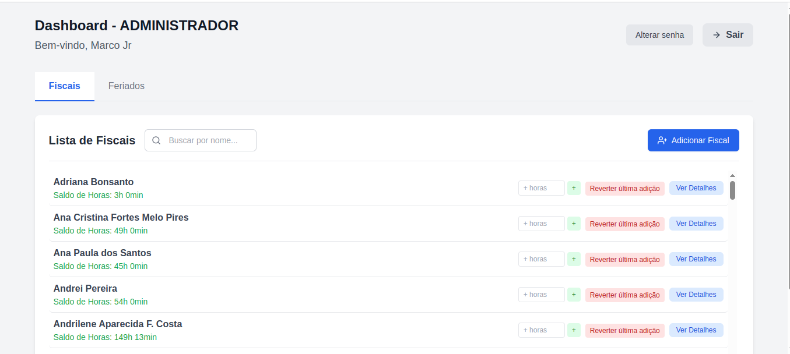
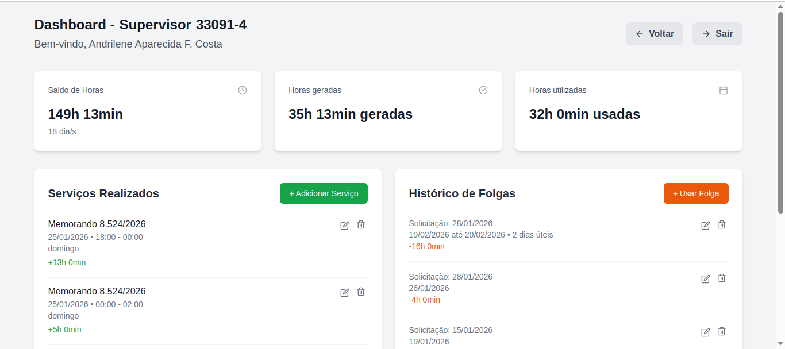

# 🏛️ Banco de Horas — SEDUPP

<div align="center">


Sistema de controle de banco de horas desenvolvido para a **Secretaria de Desenvolvimento Urbano e Posturas e Perícias (SEDUPP)** da Prefeitura de Juiz de Fora — MG.

[Funcionalidades](#-funcionalidades) • [Tecnologias](#️-tecnologias) • [Como Rodar](#️-como-rodar-localmente) • [Estrutura](#-estrutura-do-projeto) • [Segurança](#-segurança)

</div>

---

## 📋 Sobre o Projeto

O sistema permite o gerenciamento completo das horas extras dos fiscais da SEDUPP. Ao registrar um serviço, o sistema calcula automaticamente as horas de folga geradas com base no dia da semana e horário de trabalho, aplicando multiplicadores definidos pela prefeitura. O administrador também pode registrar as folgas utilizadas, descontando automaticamente do saldo de cada fiscal.

---

## 📸 Screenshots

### Dashboard do Administrador


### Dashboard do Fiscal / Supervisor


---

## ✨ Funcionalidades

- **Cadastro de serviços** com geração automática de horas de folga
- **Multiplicadores automáticos** por dia e horário:

| Período | Horário | Multiplicador |
|---------|---------|---------------|
| Segunda a Sábado | 05h – 22h | 1,5x |
| Segunda a Sábado | 22h – 05h | 1,87x |
| Domingo e Feriado | 05h – 22h | 2,0x |
| Domingo e Feriado | 22h – 05h | 2,5x |

- **Cadastro de folgas** com desconto automático do saldo
- **Folgas fracionadas** — suporte a horas parciais
- **Cadastro em lote** de múltiplos serviços de uma vez
- **Gerenciamento de feriados** para aplicação correta dos multiplicadores
- **Recuperação de senha** via e-mail com token seguro (SHA-256, uso único, expira em 1h)
- **Rate limiting** nas solicitações de reset (3 tentativas / 15 min por IP)
- **Paginação** de serviços e folgas no dashboard
- **Busca de fiscais** por nome no painel administrativo
- **CI/CD** com GitHub Actions e deploy automático via Docker

---

## 👥 Tipos de Usuário

| Perfil | Permissões | Carga Horária |
|--------|-----------|---------------|
| **ADMINISTRADOR** | Controle total: cadastrar/remover fiscais, lançar serviços e folgas, gerenciar feriados | — |
| **SUPERVISOR** | Visualiza apenas seus próprios dados | 8h/dia |
| **FISCAL** | Visualiza apenas seus próprios dados | 6h/dia |

> A carga horária impacta diretamente o cálculo de desconto nas folgas utilizadas.

---

## 🛠️ Tecnologias

| Camada | Tecnologia |
|--------|-----------|
| Linguagem | Java 21 |
| Framework | Spring Boot 4.0 |
| Frontend | Thymeleaf + Tailwind CSS |
| Banco de dados | PostgreSQL 16 |
| Segurança | Spring Security 6 |
| Containerização | Docker + Docker Compose |
| CI/CD | GitHub Actions |
| Build | Maven |
| Utilitários | Lombok, Bucket4j, Apache Commons Codec |

---

## 📋 Pré-requisitos

Antes de começar, certifique-se de ter instalado:

- [Java 21](https://adoptium.net/)
- [Maven](https://maven.apache.org/)
- [Docker](https://www.docker.com/) e [Docker Compose](https://docs.docker.com/compose/)
- [Node.js](https://nodejs.org/) (para compilar o CSS do Tailwind)
- Conta Gmail com [Senha de App](https://support.google.com/accounts/answer/185833) configurada

---

## ⚙️ Como Rodar Localmente

### 1. Clone o repositório

```bash
git clone https://github.com/brenopereira18/banco_de_horas.git
cd banco_de_horas
```

### 2. Configure as variáveis de ambiente

Crie o arquivo `.env.dev` na raiz do projeto:

```env
# Banco de dados
DB_HOST=localhost
DB_PORT=5432
DB_NAME=annual_leave
DB_USER=postgres
DB_PASSWORD=sua_senha

# E-mail (Gmail com Senha de App de 16 caracteres)
MAIL_USERNAME=seu_email@gmail.com
MAIL_PASSWORD=xxxx xxxx xxxx xxxx

# Aplicação
APP_BASE_URL=http://localhost:8080/banco_de_horas
```

> ⚠️ O arquivo `.env.dev` está no `.gitignore` e **nunca deve ser commitado**.

### Variáveis de Ambiente

| Variável | Descrição | Exemplo |
|----------|-----------|---------|
| `DB_HOST` | Host do PostgreSQL | `localhost` |
| `DB_PORT` | Porta do PostgreSQL | `5432` |
| `DB_NAME` | Nome do banco de dados | `annual_leave` |
| `DB_USER` | Usuário do PostgreSQL | `postgres` |
| `DB_PASSWORD` | Senha do PostgreSQL | `sua_senha` |
| `MAIL_USERNAME` | E-mail Gmail para envio | `seu@gmail.com` |
| `MAIL_PASSWORD` | Senha de App do Gmail (16 caracteres) | `xxxx xxxx xxxx xxxx` |
| `APP_BASE_URL` | URL base da aplicação | `http://localhost:8080/banco_de_horas` |

### 3. Compile o CSS do Tailwind

Em um terminal separado, entre na pasta do frontend e execute o comando de watch:
```bash
cd src/frontend
npx tailwindcss -i ../main/resources/static/css/input.css -o ../main/resources/static/css/output.css --watch
```

> 💡 Mantenha esse terminal rodando enquanto desenvolve. O Tailwind irá recompilar o CSS automaticamente a cada alteração nos templates.
>
> Para gerar o CSS uma única vez sem o modo watch:
> ```bash
> npx tailwindcss -i ../main/resources/static/css/input.css -o ../main/resources/static/css/output.css
> ```

### 4. Suba o banco de dados com Docker

```bash
docker-compose -f docker-compose-dev.yml up -d
```

### 5. Execute a aplicação

```bash
export $(grep -v '^#' .env.dev | xargs) && ./mvnw spring-boot:run -Dspring.profiles.active=dev
```

### 6. Acesse no navegador

```
http://localhost:8080/banco_de_horas/dashboard/login
```

---

## 🔑 Primeiro Acesso

O primeiro usuário administrador deve ser inserido diretamente no banco de dados. A senha deve ser gerada com **BCrypt** (strength 10):

```sql
INSERT INTO fiscal (full_name, email, registration, password, user_type, balance_of_hours)
VALUES (
    'Nome do Administrador',
    'admin@email.com',
    '00000-0',
    '$2a$10$SEU_HASH_BCRYPT_AQUI',
    'ADMINISTRADOR',
    0
);
```

> 💡 Para gerar o hash BCrypt, utilize o site [bcrypt.io](https://bcrypt.io).
>
> 🔐 A senha inicial de cada fiscal criado pelo administrador é a própria matrícula. O usuário deve alterá-la no primeiro acesso.

---

## 🐳 Executando com Docker (ambiente completo)

```bash
docker-compose -f docker-compose-dev.yml up --build
```

---

## 🔐 Segurança

- Senhas armazenadas com **BCrypt** (strength 10)
- Tokens de reset hasheados com **SHA-256** — apenas o hash é salvo no banco
- Token de uso único com expiração de **1 hora**
- Proteção **CSRF** em todos os formulários
- **Rate limiting** por IP (Bucket4j) nas rotas de recuperação de senha
- Acesso às rotas controlado por **Spring Security** com `@PreAuthorize`
- Variáveis sensíveis de produção gerenciadas via **variáveis de ambiente**
- Suporte a proxy reverso via header `X-Forwarded-For`

---

## 🔄 CI/CD

O projeto utiliza **GitHub Actions** para integração e entrega contínua.

O pipeline `deploy.yml` é acionado automaticamente a cada push na branch `main` e realiza:

1. Build da aplicação com Maven
2. Build da imagem Docker
3. Deploy no servidor de produção via Docker Compose

---

## 👨‍💻 Desenvolvedor

Desenvolvido por **Breno Pereira Betti**

[](https://github.com/brenopereira18)

---
